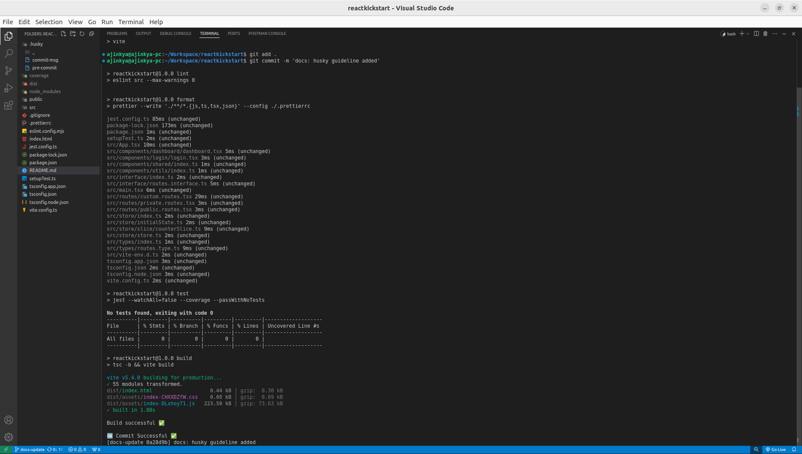

# ERP-HRMS-FRONTEND

# Follow Standard Practices To Maintain Project

| Type         | Description                                     |
| ------------ | ----------------------------------------------- |
| _PascalCase_ | FunctionName() \| CustomType \| CustomInterface |
| _camelCase_  | fileName \| variableName                        |
| _kebab_case_ | folder_name                                     |

##### In package.json remove --passWithNoTests once added your test file

# Routing Guide

_src/routes/private.routes.tsx_

- go to this path
- add component which you want to accessible after user authenticated
- private component will be accessible only when token set in local storage
- you can customize token logic in _src/routes/private.routes.tsx_ with "token"

_src/routes/public.routes.tsx_

- go to this path
- add component which you want to accessible before user authenticated

# Husky Guide

_.husky/commit-msg_

- default commit message format : git commit -m 'keyword: your message here'
- "keyword" followed by "colon" followed by "space" followed by "your message"
- modify COMMITFORMAT keywords which you want to follow by fellow developer in your team

_.husky/pre-commit_
customize scripts that you want to validate on pre-commit

